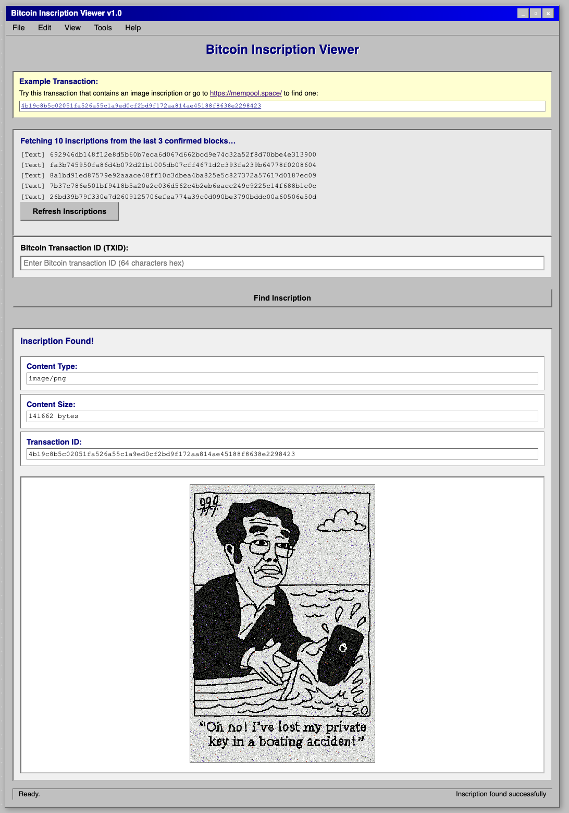

# Bitcoin Inscriptions Viewer

A tool to decode inscriptions on Bitcoin blocks. It fetches the first 10 inscriptions from the last 3 confirmed blocks.



Make sure you have Rust installed, clone this repository and then run:

```bash
cargo run --release              
```

The terminal will open up a browser window serving the HTML page.
Update the transaction ID to whatever you need to decode, for example: [4b19c8b5c02051fa526a55c1a9ed0cf2bd9f172aa814ae45188f8638e2298423](https://memepool.space/tx/4b19c8b5c02051fa526a55c1a9ed0cf2bd9f172aa814ae45188f8638e2298423)
